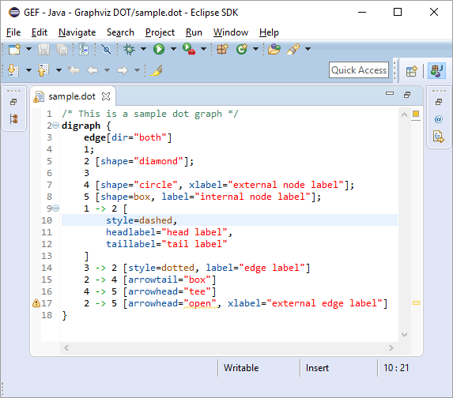
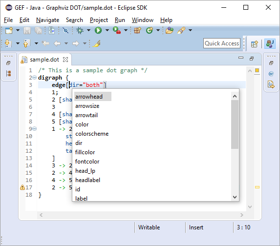
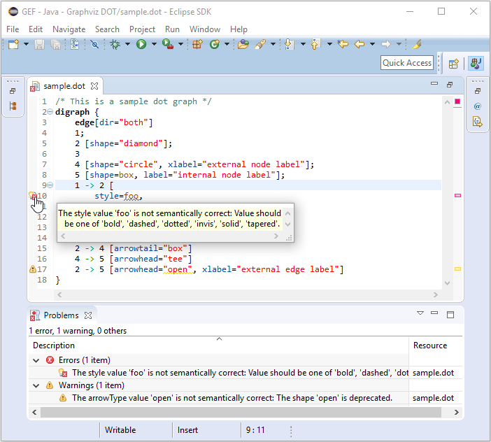
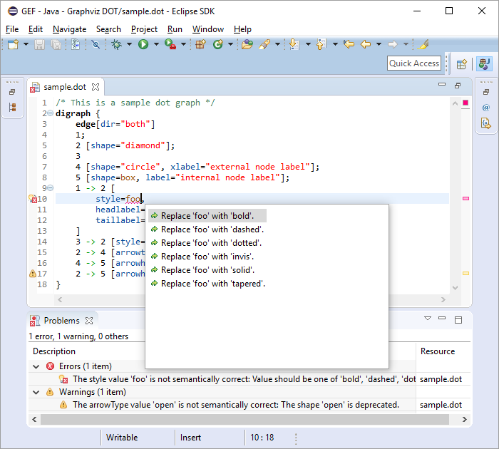
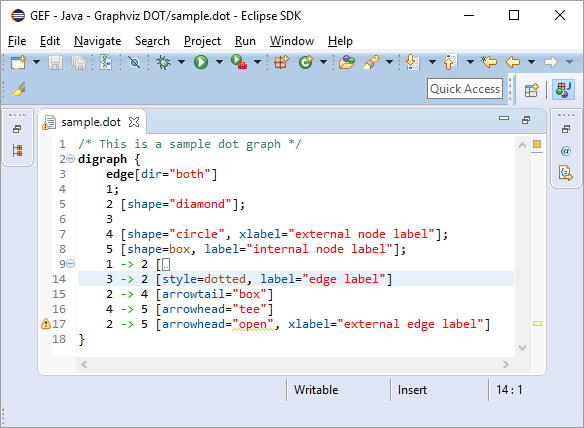
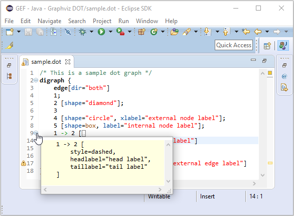
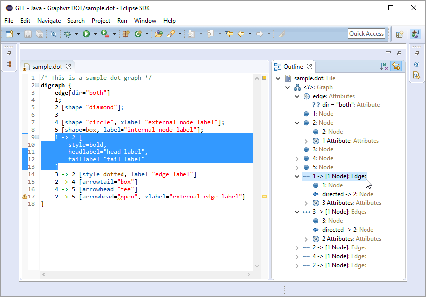
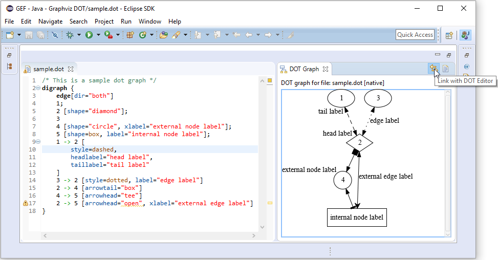

# Editing Graphviz *.dot files with the GEF DOT Editor

**[Graphviz](http://www.graphviz.org/) *.dot files** are usual text files containing the textual representation of graph definitions. The structure of these *.dot files are defined by the [DOT Language](http://www.graphviz.org/content/dot-language) that provides more than 150 graph, subgraph, node and edge attributes to influence the graph visualization. Some of these dot attribute values are distinct, some of them are following their own language specification and some of them depend on the previously defined dot attribute values. Remembering the name and the possible values of all these dot attributes or searching them continuously within the [Graphviz documentation](http://www.graphviz.org/content/attrs) not only ties up valuable resources, but also makes the entire process more error prone. And here is where the GEF DOT Editor could be of your assistance.

**The GEF DOT Editor**1 is an [Xtext](https://www.eclipse.org/Xtext/)-based textual editor registered for *.dot files within the Eclipse Workbench UI. It is - together with the GEF DOT Graph View2 - part of the GEF Graphviz DOT authoring environment and - amongst others - provides support for the following features:

**1. Syntax Highlighting:** The GEF DOT Editor uses different visual styles (different colors and fonts) for the different dot language elements. The keywords (such as 'graph', 'digraph', 'node', 'edge', ...) are represented in bold, the dot attribute names appear in blue, their values are shown in brown (or in red if they are quoted), while the embedded comments are highlighted in green. This kind of text decoration not only makes it easier to distinguish between the different dot language elements but also helps the user to find possible errors within the currently opened dot file.

**2. Content Assist:** The GEF DOT Editor is able to provide suggestions on how to complete the statement/expression the user has just started to type. This content assist functionality can be accessed on any place within the opened dot file using the keyboard shortcut `Ctrl + Space`. Depending on the current cursor position, only those dot language elements will be offered that make sense within the given context: graph attributes names within a graph context, edge attribute names within an edge context, and all possible attribute values within a certain attribute context.

**3. Background Validation:** The GEF DOT Editor continuously validates the content of the opened dot file while the user is editing, even if the current dot file has not been saved yet. When the editor issues a warning/error, e.g. in case of using a deprecated/invalid dot language element, it underlines the corresponding part in yellow/red that contains the warning/error. It also puts some warning/error markers with a meaningful message on the left and right side of the editor and also populates the Problems view with all the recognized issues. With such a support the user can easily identify the parts of the dot file that need to be fixed.

**4. Quickfixes:** The GEF DOT Editor is - in certain cases - able to automatically fix the problems the user made while editing a dot file. In such cases, the editor offers so called quickfixes to the user. This functionality is available either throught the context menu of the warning/error marker or using the keyboard shortcut `Ctrl + 1`. Applying such a quickfix can for instance replace an invalid dot attribute value by a valid one.

**5. Folding:** The GEF DOT Editor supports collapsing certain parts of the currently opened dot file. This functionality is especially handy for large dot files to hide unnecessary details, e.g. the attributes belonging to a certain edge. Hovering on a collapsed part still enables the user to take a look at the hidden part without explicitly expanding it.

**6. Outline View:** The GEF DOT Editor provides an outline view to help the user navigating through the opened dot file. It provides a hierarchical view of the graph nodes and edges together with their attributes. By default, it represents the elements in the same order as defined within the dot file, but also allows the user to sort them alphabetically. Moreover, the user can choose to synchronize the outline view selection with the editor selection by switching the *'Link with Editor'* mode on, so a selection on an element within the outline view  automatically highlights the corresponding dot element within the GEF DOT Editor.

**7. Automatic Sync:** The GEF DOT Editor is also able to automatically notify the GEF DOT Graph View when the user saves the currently modified dot file. Using the *'Link with DOT Editor'* functionality, there is no need to manually trigger the graph visualization to re-render the currently edited dot file within the GEF DOT Graph View.

**Conclusion**

The GEF DOT Editor provides useful functionalities that come in handy when working with Graphviz *.dot files. Apart from that, the open source [GEF Framework](https://github.com/eclipse/gef/wiki) provides further components as parts of the GEF Graphviz DOT authoring environment. For further information, take a look at the [GEF DOT User Guide](https://github.com/eclipse/gef/wiki/DOT-User-Guide) or visit the [GEF session on the Eclipsecon Europe 2016](https://www.eclipsecon.org/europe2016/session/gef4-dot-oh-dot-oh).

At the time of this writing, the functionality of the GEF Graphviz DOT authoring environment is limited as follows:

1 The GEF DOT Editor is not yet able to read all the dot attribute values (e.g: html-like labels)

2 The GEF DOT Graph View is not yet able to visualize all the dot attribute values.
